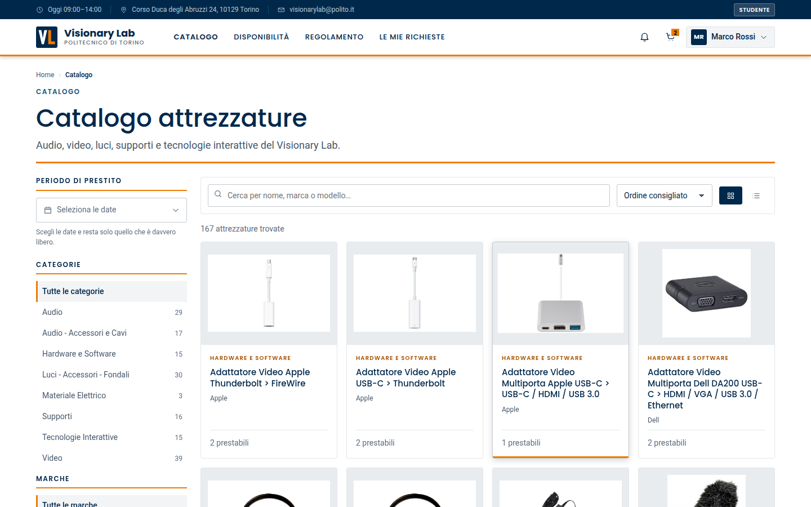
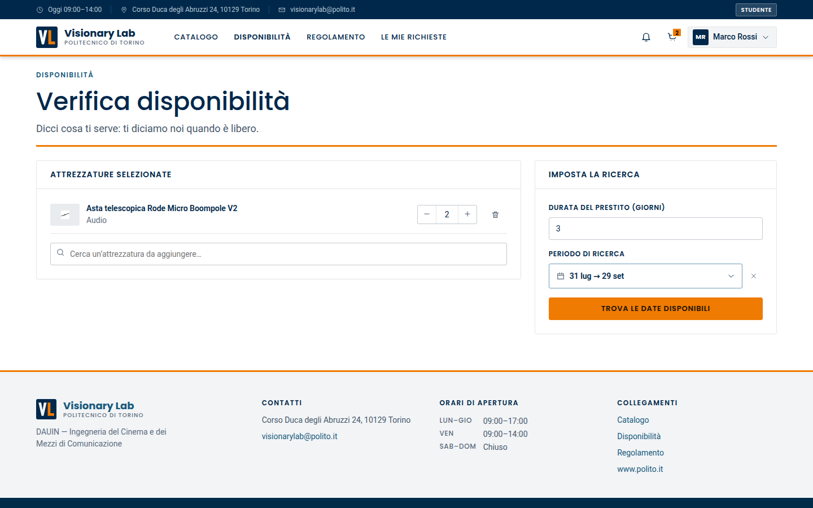
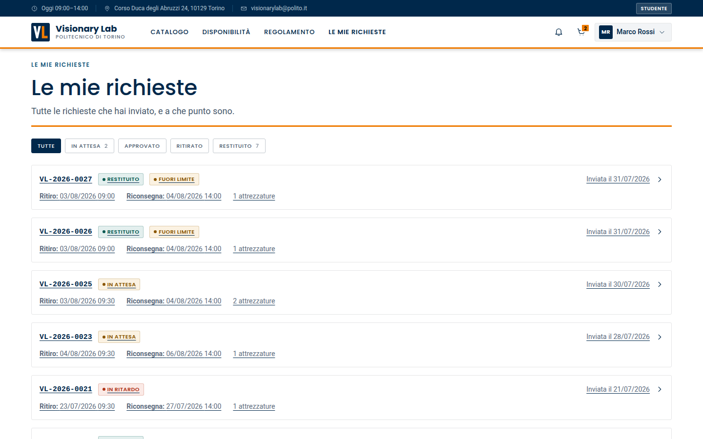
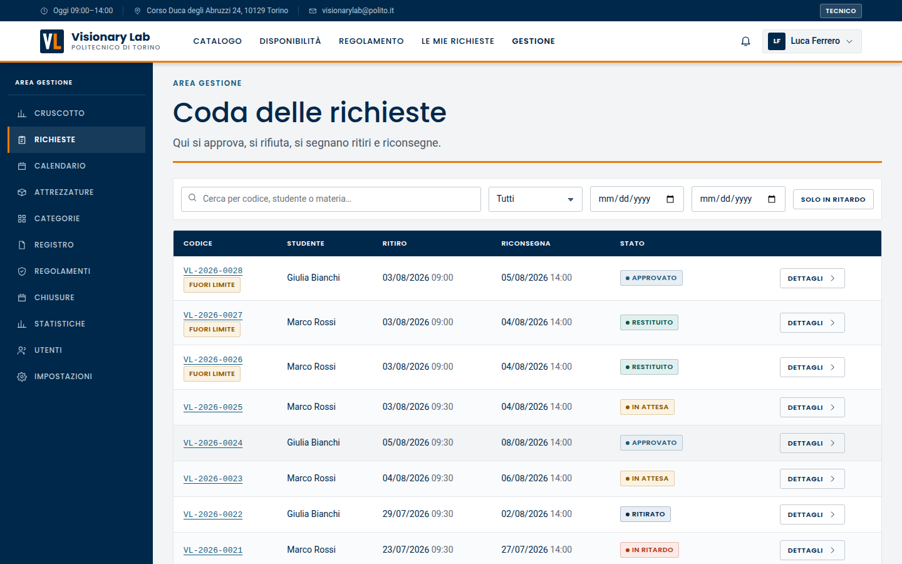
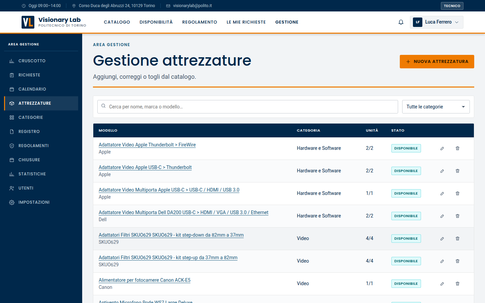
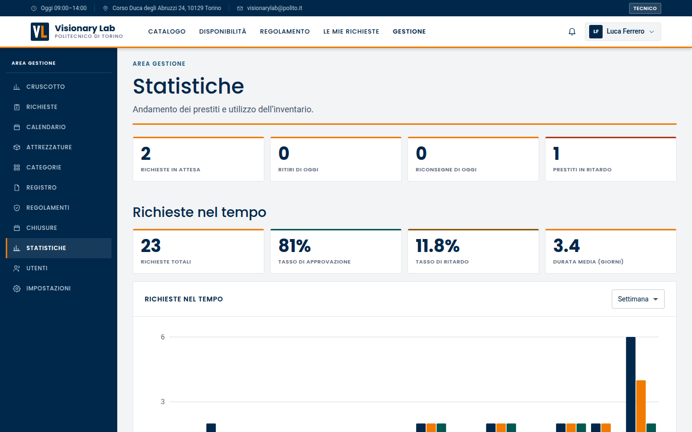
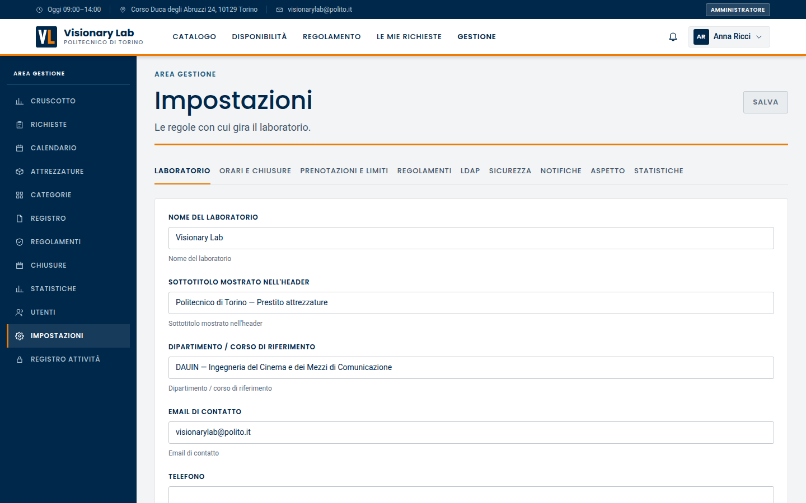

<p align="center">
  <picture>
    <source media="(prefers-color-scheme: dark)" srcset="docs/logo-dark.svg">
    
  </picture>
</p>

# Visionary Lab

[](https://github.com/Sipioteo/vlab/actions/workflows/quality.yml)
[](https://github.com/Sipioteo/vlab/actions/workflows/security.yml)

Questo repository è **un esercizio di stile**: il portale di prestito
attrezzature del Visionary Lab (Ufficio Multimedialità, DAUIN, Politecnico di
Torino) ripensato e riscritto da zero, senza riusare una riga del servizio
originale. Non è un mockup e non è una demo di facciata: **è pienamente
funzionante**. Backend PHP con 176 test, frontend React con 134, catalogo
reale, calcolo delle disponibilità, macchina a stati degli ordini, login con
LDAP (finto in sviluppo, vero in produzione), audit log. Si clona, si lancia
`./run.sh` e funziona.

Il contratto tecnico completo (API, schema del database, macchina a stati,
matrice dei permessi, registro impostazioni) è in [`SPEC.md`](SPEC.md), che
resta la fonte di verità: questo README è la guida operativa.

---

## Congedo

> Questo è l'ultimo progetto che scrivo per il Politecnico.
> Qui ho imparato il mestiere, e mi sembrava giusto chiudere
> con una cosa fatta bene. Alle persone del Visionary Lab:
> è stato un privilegio.

---

## Il portale

<table>
  <tr>
    <td width="50%">
      
      <br><sub><b>Home</b>: catalogo pubblico, numeri del laboratorio, accesso rapido alla verifica disponibilità.</sub>
    </td>
    <td width="50%">
      
      <br><sub><b>Catalogo</b>: 167 attrezzature, filtri per categoria, marca e periodo di prestito.</sub>
    </td>
  </tr>
  <tr>
    <td width="50%">
      
      <br><sub><b>Verifica disponibilità</b>: dato un insieme di attrezzature, quali finestre sono libere.</sub>
    </td>
    <td width="50%">
      
      <br><sub><b>Le mie richieste</b>: storico e stato di avanzamento, dalla richiesta alla riconsegna.</sub>
    </td>
  </tr>
  <tr>
    <td width="50%">
      
      <br><sub><b>Area gestione, richieste</b>: approvazione, rifiuto, ritiri e riconsegne.</sub>
    </td>
    <td width="50%">
      
      <br><sub><b>Area gestione, attrezzature</b>: catalogo e unità fisiche con il loro stato.</sub>
    </td>
  </tr>
  <tr>
    <td width="50%">
      
      <br><sub><b>Statistiche</b>: richieste nel tempo, tasso di approvazione, ritardi, durata media.</sub>
    </td>
    <td width="50%">
      
      <br><sub><b>Impostazioni</b>: 88 parametri modificabili a caldo, nessuna costante nel codice.</sub>
    </td>
  </tr>
  <tr>
    <td width="50%">
      
      <br><sub><b>Mobile, home</b>: la stessa interfaccia, senza app dedicata.</sub>
    </td>
    <td width="50%">
      
      <br><sub><b>Mobile, catalogo</b>: filtri richiudibili e liste a colonna singola.</sub>
    </td>
  </tr>
</table>

---

## Indice

- [Avvio rapido](#avvio-rapido)
- [Architettura](#architettura)
- [`run.sh`: comandi e opzioni](#runsh-comandi-e-opzioni)
- [Test](#test)
- [Integrazione continua](#integrazione-continua)
- [Configurazione LDAP](#configurazione-ldap)
- [Amministrazione delle impostazioni](#amministrazione-delle-impostazioni)
- [Portabilità del database](#portabilità-del-database)
- [Note di deployment](#note-di-deployment)
- [Struttura del repository](#struttura-del-repository)
- [Marchi e contenuti](#marchi-e-contenuti)
- [Licenza](#licenza)

---

## Avvio rapido

**Prerequisiti:** PHP ≥ 8.1 (con `pdo`, `pdo_sqlite`, `mbstring`, `json`,
`openssl`), Composer, Node.js ≥ 18, npm. Non serve altro: niente Docker,
niente database da installare, niente `sudo`.

```bash
git clone https://github.com/Sipioteo/vlab.git && cd vlab
./run.sh
```

Lo script verifica i prerequisiti, installa le dipendenze, crea
`backend/.env` (con un `JWT_SECRET` casuale), prepara il database SQLite,
applica migrazioni e seeder, avvia entrambi i server e resta in foreground.

| Servizio | URL |
|---|---|
| **Applicazione (SPA)** | <http://localhost:8080> |
| API | <http://127.0.0.1:8081/api/v1> |
| Health check | <http://127.0.0.1:8081/api/v1/health> |

> Usa sempre la porta **8080**: il dev server Vite inoltra `/api` al backend,
> quindi la SPA e le API condividono l'origine e non ci sono problemi di CORS.

`Ctrl-C` ferma entrambi i server senza lasciare processi orfani.

### Utenti di prova

Con `LDAP_MODE=fake` (default) l'autenticazione è simulata da un authenticator
locale. La password è **`password`** per tutti.

| Username | Ruolo | Cosa può fare |
|---|---|---|
| `student1` | studente | catalogo, carrello, richieste proprie |
| `student2` | studente | come sopra (utile per provare i conflitti di disponibilità) |
| `tecnico1` | tecnico | approva, consegna, riconsegna, gestisce catalogo e unità |
| `borsista1` | borsista | approva, consegna, riconsegna; statistiche ridotte |
| `admin1` | amministratore | tutto, incluse impostazioni, utenti e audit log |

---

## Architettura

```
┌──────────────────────────────┐            ┌──────────────────────────────────┐
│  Browser · SPA               │            │  PHP 8.1 · Slim 4                │
│  React 18 + TypeScript       │  /api/v1   │  public/index.php                │
│  Vite dev server :8080       │ ─────────► │  php -S :8081                    │
│  proxy /api → :8081          │   JSON     │                                  │
└──────────────────────────────┘            │  CORS → JSON body → Auth → Role  │
                                            │  → Validazione → Rotta           │
                                            │  Services (dominio) + Eloquent   │
                                            │  LdapAuthenticatorInterface      │
                                            │    ├── FakeLdapAuthenticator     │
                                            │    └── RealLdapAuthenticator     │
                                            └────────────────┬─────────────────┘
                                                             ▼
                                             SQLite (default) · MySQL 8 · PostgreSQL 14+
```

**Backend.** Slim 4 (PSR-7/11/15), `illuminate/database` (Eloquent) montato via
`Capsule`, contenitore PHP-DI. Le migrazioni le gestisce un runner artigianale
(`bin/console migrate`) che registra quelle applicate nella tabella
`migrations`: nessuna dipendenza dal framework Laravel completo. I controller
fanno solo validazione e serializzazione, le regole di business vivono nei
servizi di `src/Domain/`, e ogni modello ha un `Resource` esplicito che
definisce il JSON esposto.

**Stateless.** Nessuna sessione PHP: lo stato di autenticazione è un JWT tenuto
dalla SPA più una riga `refresh_tokens` sul database. Questo permette di
servire il backend con `php -S` in sviluppo e con qualsiasi SAPI in produzione.

**Frontend.** React 18 + TypeScript + Vite, React Router, TanStack Query per il
data fetching e la cache. Nessuna libreria di UI: il design system è CSS custom
con token in `src/styles/tokens.css`. Tutti i testi visibili all'utente sono in
italiano e centralizzati in `src/i18n/it.ts`; le etichette degli enum arrivano
a runtime da `GET /meta/enums`, mai hardcodate.

**Sequenza di boot della SPA.** Al primo render la SPA chiama
`POST /auth/refresh` (se c'è un refresh token salvato), `GET /settings/public`
e `GET /meta/enums`. Finché il refresh non si risolve viene mostrato uno
splash, poi il router prende il controllo. Se ci sono regolamenti globali
pendenti, ogni rotta viene sostituita dalla pagina di accettazione.

---

## `run.sh`: comandi e opzioni

Script POSIX-bash unico, funzionante su **Linux, macOS e Windows Git Bash**.
Risolve da solo la propria directory, quindi si può invocare da qualsiasi CWD.

### Comandi

| Comando | Effetto |
|---|---|
| *(nessuno)* / `start` | Flusso completo: prerequisiti, dipendenze, DB, migrazioni, seed, avvio di entrambi i server |
| `install` | Solo installazione delle dipendenze (composer + npm) |
| `migrate` | Solo migrazioni |
| `seed` | Solo seeder |
| `fresh` | Ricrea il database da zero, seed con dati demo, poi avvia |
| `backend` | Solo backend, porta 8081 |
| `frontend` | Solo frontend, porta 8080 |
| `test` | PHPUnit e poi Vitest; esce ≠ 0 se una delle due fallisce |
| `stop` | Termina i processi registrati in `.run/*.pid` |
| `install-runtime` | Tenta di installare i runtime di sistema mancanti (PHP + estensioni, Composer, Node.js/npm) con il package manager del SO |
| `help` | Testo d'uso |

### Opzioni

| Opzione | Effetto |
|---|---|
| `--backend-port N` | Cambia la porta del backend (aggiorna anche il proxy Vite via `VITE_API_TARGET`) |
| `--frontend-port N` | Cambia la porta del frontend |
| `--no-install` | Salta l'installazione delle dipendenze |
| `--no-seed` | Salta il seeding |
| `--fresh` | Come il comando `fresh` |
| `--real-ldap` | Esporta `LDAP_MODE=real` invece del default `fake` |
| `--install-runtime` | Come il comando `install-runtime`, ma combinabile con qualsiasi altro comando: prova a installare i runtime mancanti prima del controllo prerequisiti |
| `--install-runtime-yes` | Come `--install-runtime` ma senza chiedere conferma interattiva (obbligatorio se stdin non è un terminale) |
| `-h`, `--help` | Testo d'uso |

### Comportamento

- **Idempotente.** `./run.sh` usa `migrate` e `db:seed`, entrambi idempotenti:
  i dati **sopravvivono** ai riavvii. Solo `--fresh` (o `fresh`) cancella il
  file SQLite, esegue `migrate:fresh` e aggiunge 25 ordini demo con
  `db:seed --demo`.
- **`.env` mai sovrascritto.** Se `backend/.env` manca viene creato da
  `.env.example` con un `JWT_SECRET` casuale di 48 caratteri esadecimali; se
  esiste, viene lasciato intatto.
- **Dipendenze on-demand.** `composer install` solo se `vendor/autoload.php`
  manca o se `composer.lock` è più recente di `vendor/`; `npm ci` (con
  fallback su `npm install`) solo se `node_modules/` manca o se
  `package-lock.json` è più recente.
- **Porte.** Prima di occuparle verifica che siano libere (`lsof`, poi `ss`,
  poi `netstat`, poi probe `/dev/tcp` di bash) e, se occupate, dice quale
  porta e come cambiarla.
- **Readiness.** Attende fino a 30 s che `GET /api/v1/health` risponda; in caso
  contrario stampa la coda di `backend/storage/logs/server.log` ed esce.
- **Arresto pulito.** `Ctrl-C` termina l'intero albero dei processi figli:
  `npm` genera `sh -c vite` che genera `node vite` che genera `esbuild`, e
  fermarsi al primo livello lascerebbe Vite orfano sulla porta. L'albero è
  ricostruito da uno snapshot di `ps`, senza `pkill` né assunzioni sui process
  group (per compatibilità con Git Bash).
- **Log.** Output di entrambi i server prefissato con `[backend]` e
  `[frontend]` a schermo, duplicato in `backend/storage/logs/`.
- **Colori** solo se stdout è un TTY; rispetta `NO_COLOR`.
- **`install-runtime`.** Rileva quali runtime mancano o sono sotto la versione
  minima (PHP ≥8.1, Node ≥18) e prova a installarli con il package manager
  disponibile (Linux: `apt-get`/`dnf`/`pacman`/`zypper`, con `sudo` se non si è
  root; macOS: `brew`; Windows/Git Bash: `winget`/`scoop`/`choco`). Composer
  usa prima il package manager, poi ricade sull'installer ufficiale
  (`getcomposer.org`) verificandone la firma SHA-384 prima di eseguirlo. Prima
  di toccare il sistema stampa i comandi esatti che eseguirà e chiede conferma
  interattiva (`y`/`s` per procedere); se stdin non è un terminale non chiede
  nulla e si ferma, a meno di usare `--install-runtime-yes`. Se nulla manca
  stampa "runtime già presenti, nulla da installare" e prosegue. Ogni voce
  installata/fallita/saltata viene riportata singolarmente e lo script
  prosegue comunque con il normale controllo prerequisiti.

### Codici di uscita

| Codice | Significato |
|---|---|
| `0` | Successo o arresto pulito (`Ctrl-C`) |
| `1` | Prerequisiti mancanti o porta occupata |
| `2` | Installazione delle dipendenze fallita |
| `3` | Migrazioni o seed falliti |
| `4` | Il backend non è diventato healthy |

`install-runtime` usa gli stessi codici 0/1: `0` se tutto era già a posto o è
stato installato con successo, `1` se al termine mancano ancora prerequisiti
(il messaggio del controllo finale indica cosa manca ancora).

### Windows e Git Bash

`npm` viene risolto con `command -v npm || command -v npm.cmd`; non si usa mai
`lsof` come unico metodo, né `pkill`, né i process group. Il server PHP è
`php -S`, disponibile in ogni distribuzione PHP per Windows.

---

## Test

```bash
./run.sh test            # entrambe le suite

cd backend  && vendor/bin/phpunit    # 176 test
cd frontend && npx vitest run        # 134 test
cd frontend && npm run build         # type-check (tsc -b) + build di produzione
```

Il backend gira su SQLite in memoria con migrazioni applicate a ogni test; il
frontend usa Vitest, Testing Library e MSW, con le risposte API simulate a
partire dai payload di `SPEC.md`.

---

## Integrazione continua

Due workflow GitHub Actions, entrambi su `ubuntu-latest`.

| Workflow | File | Cosa fa |
|---|---|---|
| **Quality Check** | [`.github/workflows/quality.yml`](.github/workflows/quality.yml) | Job `backend`: PHP 8.1, `composer install`, PHPUnit. Job `frontend`: Node 22, `npm ci`, Vitest, `npm run build` |
| **Security Check** | [`.github/workflows/security.yml`](.github/workflows/security.yml) | `composer audit`, `npm audit --audit-level=high`, scansione dei segreti con gitleaks su tutta la storia |

Quality Check parte su ogni push, su ogni pull request e a mano
(`workflow_dispatch`); le esecuzioni superate da un push successivo vengono
annullate. Security Check aggiunge una schedulazione settimanale, perché una
dipendenza diventa vulnerabile anche quando nessuno tocca il codice.

---

## Configurazione LDAP

L'autenticazione passa sempre da `LdapAuthenticatorInterface`, con due
implementazioni intercambiabili.

### Modalità `fake` (default, sviluppo)

`FakeLdapAuthenticator` verifica le credenziali contro la tabella
`fake_ldap_users`, popolata dal seeder con i cinque utenti di prova. Non serve
l'estensione PHP `ldap` (`run.sh` avvisa ma non fallisce se manca).

### Modalità `real` (produzione)

`RealLdapAuthenticator` fa il bind al server LDAP di ateneo. Serve l'estensione
PHP `ldap` abilitata.

Si attiva in tre modi, in ordine di precedenza:

1. la variabile d'ambiente `LDAP_MODE=real` (per esempio `./run.sh --real-ldap`);
2. il valore di `.env`;
3. l'impostazione `ldap.mode` nel registro (modificabile a caldo da un admin).

I parametri di connessione vivono nel registro impostazioni (gruppo `ldap.`) e
sono modificabili dall'interfaccia di amministrazione senza toccare il codice:

| Chiave | Descrizione |
|---|---|
| `ldap.host`, `ldap.port`, `ldap.encryption` | Endpoint e cifratura (`none`, `ssl`, `tls`) |
| `ldap.base_dn`, `ldap.user_filter` | Ricerca dell'utente (`%s` = username) |
| `ldap.bind_dn`, `ldap.bind_password` | Account di servizio per la ricerca |
| `ldap.attr_*` | Mappatura degli attributi (uid, mail, givenName, sn, cn, matricola, memberOf) |
| `ldap.group_base_dn`, `ldap.group_filter` | Ricerca dei gruppi di appartenenza |
| `ldap.role_map` | JSON gruppo-DN verso ruolo applicativo |
| `ldap.default_role` | Ruolo per chi non corrisponde a nessun gruppo |
| `ldap.timeout_seconds` | Timeout di connessione |

Un amministratore può verificare la configurazione con
`POST /api/v1/settings/ldap/test` (bottone «Prova connessione» nella pagina
impostazioni) prima di passare a `real`.

**Ruoli.** Il ruolo è normalmente derivato dai gruppi LDAP a ogni login. Per
fissarlo manualmente:

```bash
cd backend && php bin/console user:role student1 technician
```

Il comando imposta `role_locked = true`, così i login successivi non lo
sovrascrivono, e invalida i token esistenti dell'utente.

---

## Amministrazione delle impostazioni

**Nessuna costante di business è hardcodata.** Le 88 impostazioni vivono nella
tabella `settings` e sono modificabili a runtime da un amministratore in
*Gestione → Impostazioni* (`PUT /api/v1/settings` per un aggiornamento
massivo, `PUT /api/v1/settings/{key}` per una singola chiave). Ogni valore è
tipizzato (`int`, `bool`, `enum`, `string`, `json`, `secret`) e validato lato
server; i valori `secret` non vengono mai restituiti in chiaro.

| Gruppo | Cosa controlla |
|---|---|
| `lab.*` | Nome, sottotitolo, dipartimento, contatti, indirizzo |
| `hours.*` | Fuso orario, orari settimanali di apertura, slot di ritiro e riconsegna |
| `booking.*` | Durata massima del prestito, quote mensili e annuali, prestiti attivi, finestra di prenotazione, quantità per prodotto, obbligo di motivazione o docente, scadenza per l'annullamento, tolleranza per ritardi e mancati ritiri, TTL del carrello, assegnazione automatica delle unità |
| `regulations.*` | Obbligo di accettazione, comportamento al cambio di versione |
| `ui.*` | Colori del tema, elementi per pagina, vista predefinita del catalogo, catalogo anonimo, banner |
| `ldap.*` | Vedi sopra |
| `security.*` | Durata dei token, limitazione dei tentativi di login |
| `notifications.*`, `stats.*` | Notifiche e parametri delle dashboard |

Il sottoinsieme pubblico (branding, limiti utili alla SPA) è servito senza
autenticazione da `GET /api/v1/settings/public`; il resto richiede un ruolo
staff. Ogni modifica finisce nell'audit log (`GET /api/v1/audit-logs`, solo
admin).

Per ispezionare le impostazioni da riga di comando:

```bash
cd backend && php bin/console settings:list
```

---

## Portabilità del database

Le stesse migrazioni e le stesse query girano su **SQLite**, **MySQL 8** e
**PostgreSQL 14+**. Si cambia motore solo con le variabili di `backend/.env`:

```dotenv
# SQLite (default)
DB_DRIVER=sqlite
DB_DATABASE=database/vlab.sqlite

# MySQL 8
DB_DRIVER=mysql
DB_HOST=127.0.0.1
DB_PORT=3306
DB_DATABASE=vlab
DB_USERNAME=vlab
DB_PASSWORD=****
DB_CHARSET=utf8mb4

# PostgreSQL 14+
DB_DRIVER=pgsql
DB_HOST=127.0.0.1
DB_PORT=5432
DB_DATABASE=vlab
DB_USERNAME=vlab
DB_PASSWORD=****
```

Dopo il cambio basta rieseguire `php bin/console migrate && php bin/console db:seed`.
`run.sh` non crea né configura server MySQL o PostgreSQL: quelli si
predispongono a mano.

Le regole che rendono possibile la portabilità (vincolanti per chi modifica il
codice):

- niente colonne `ENUM` native: stringhe più validazione applicativa;
- niente funzioni di data specifiche del motore (`DATE_ADD`, `DATEDIFF`,
  `strftime`, `date_trunc`): l'aritmetica sulle date si fa in PHP con
  `DateTimeImmutable`, e le aggregazioni per giorno, settimana o mese si
  calcolano lato PHP;
- niente funzioni `JSON_*` in SQL: le colonne JSON si leggono e scrivono
  intere;
- niente logica di business affidata a `ON DELETE CASCADE` (su SQLite serve
  `PRAGMA foreign_keys=ON`, che il bootstrap imposta);
- timestamp sempre in UTC; i calcoli sui giorni lavorativi usano il fuso del
  laboratorio (`hours.timezone`, default `Europe/Rome`);
- ricerca testuale con `LIKE '%…%'` e `LOWER()` su entrambi i lati.

---

## Note di deployment

Target di riferimento: **PHP 8.1** (il codice non usa nulla di più recente).

### 1. Build del frontend

```bash
cd frontend
npm ci
npm run build        # tsc -b + vite build, output in frontend/dist/
```

`dist/` contiene file statici: si servono da un qualsiasi web server. Poiché è
una SPA con routing lato client, ogni percorso sconosciuto deve ricadere su
`index.html`.

In produzione la SPA chiama `/api/v1/...` sulla stessa origine: la scelta più
semplice è servire gli statici e proxare `/api` allo stesso host. Se invece
backend e frontend stanno su origini diverse, si valorizza `VITE_API_BASE_URL`
a build time e si aggiunge l'origine della SPA a `APP_FRONTEND_URL` nel `.env`
del backend (è il valore usato dal middleware CORS).

Esempio Nginx:

```nginx
server {
    root /var/www/vlab/frontend/dist;

    location / {
        try_files $uri $uri/ /index.html;      # fallback SPA
    }

    location /api/ {
        proxy_pass http://127.0.0.1:8081;
        proxy_set_header Host $host;
        proxy_set_header X-Forwarded-For $proxy_add_x_forwarded_for;
        proxy_set_header X-Forwarded-Proto $scheme;
    }
}
```

In alternativa si punta la document root su `backend/public/` (unico file PHP
raggiungibile dal web è `index.php`) e si servono gli statici da lì.

### 2. Backend

```bash
cd backend
composer install --no-dev --optimize-autoloader
php bin/console migrate
php bin/console db:seed          # idempotente: sicuro anche in aggiornamento
```

`.env` di produzione:

```dotenv
APP_ENV=production
APP_DEBUG=false
APP_URL=https://prestiti.example.it
APP_FRONTEND_URL=https://prestiti.example.it
JWT_SECRET=<48+ caratteri casuali>      # obbligatorio: senza, il boot fallisce
LDAP_MODE=real
```

Da verificare prima di andare in produzione:

- `JWT_SECRET` casuale e segreto (in `APP_ENV=production` l'avvio si interrompe
  se manca); ruotarlo invalida tutte le sessioni;
- `APP_DEBUG=false`, così gli errori non espongono stack trace;
- `backend/storage/` scrivibile dall'utente del web server (upload dei
  regolamenti, log, contatori del rate limit) e **non** servito dal web;
- `backend/database/*.sqlite` fuori dalla document root, oppure si usa MySQL o
  PostgreSQL;
- HTTPS a monte: l'applicazione non termina TLS.

### 3. Manutenzione periodica

Due comandi idempotenti, da schedulare (per esempio ogni notte):

```bash
php bin/console orders:refresh   # marca overdue e mancati ritiri
php bin/console carts:prune      # elimina i carrelli scaduti (booking.cart_ttl_hours)
```

---

## Struttura del repository

```
vlab/
├── run.sh                     # entrypoint unico (avvio, test, stop)
├── README.md                  # questo file
├── LICENSE                    # MIT, solo per il codice
├── SPEC.md                    # contratto tecnico vincolante
├── .github/workflows/         # quality.yml, security.yml
├── docs/
│   └── screens/               # schermate usate in questo README
├── data/
│   └── catalog.json           # catalogo importato dal seeder
├── backend/
│   ├── bin/console            # CLI: migrate, migrate:fresh, db:seed, settings:list,
│   │                          #      user:role, orders:refresh, carts:prune
│   ├── config/                # settings.php, database.php (letti da env)
│   ├── public/index.php       # front controller (unico PHP esposto al web)
│   ├── src/
│   │   ├── bootstrap.php      # container, Eloquent, middleware, rotte /api/v1
│   │   ├── Domain/            # Auth, Availability, Calendar, Orders, Regulations,
│   │   │                      # Settings, Stats: le regole di business
│   │   ├── Http/              # Controllers, Middleware, Resources (serializzatori)
│   │   ├── Models/            # modelli Eloquent
│   │   └── Support/           # Dates, Enums, Migrator, Paginator, AuditLogger
│   ├── database/
│   │   ├── migrations/        # 0001…0019, applicate dal runner interno
│   │   ├── seeders/           # Settings, Catalog, FakeUsers, Regulations,
│   │   │                      # Closures, DemoOrders
│   │   └── vlab.sqlite        # ignorato da git, creato da run.sh
│   ├── storage/               # ignorato da git: upload, log, rate limit
│   └── tests/                 # PHPUnit: Unit/ e Feature/
└── frontend/
    ├── vite.config.ts         # porta 8080, proxy /api verso VITE_API_TARGET
    └── src/
        ├── api/               # client tipizzato + endpoint
        ├── auth/              # AuthProvider, guardie di rotta
        ├── components/        # design system e componenti di dominio
        ├── pages/             # rotte pubbliche, studente e staff (pages/staff/)
        ├── settings/          # SettingsProvider (branding e limiti runtime)
        ├── styles/            # token e CSS
        ├── i18n/it.ts         # tutte le stringhe italiane
        └── types/api.ts       # tipi TS speculari ai payload di SPEC.md
```

Cartelle ignorate da git: `backend/vendor/`, `frontend/node_modules/`,
`frontend/dist/`, `backend/database/*.sqlite`, `backend/storage/`, `.run/`,
`backend/.env`.

---

## Marchi e contenuti

«Politecnico di Torino», «Visionary Lab» e i marchi, i loghi e i segni
distintivi collegati appartengono al Politecnico di Torino. Le fotografie dei
prodotti provengono dal portale originale e restano dei rispettivi titolari.

Questo progetto è un esercizio indipendente. Non è affiliato al Politecnico di
Torino, non è approvato né sponsorizzato dall'ateneo e non lo rappresenta in
alcun modo. Il materiale di marca e le immagini sono inclusi a solo scopo
dimostrativo, per mostrare il portale nel contesto per cui è stato pensato, e
vengono rimossi su richiesta di chi ne detiene i diritti.

---

## Licenza

Il codice di questo repository è distribuito con licenza MIT: si veda
[`LICENSE`](LICENSE).

Copyright (c) 2026 Matteo Sipione.

La licenza copre **solo il codice**. Loghi, marchi, segni distintivi e
fotografie dei prodotti sono esclusi dalla concessione MIT e restano dei
rispettivi titolari: si veda [Marchi e contenuti](#marchi-e-contenuti).
